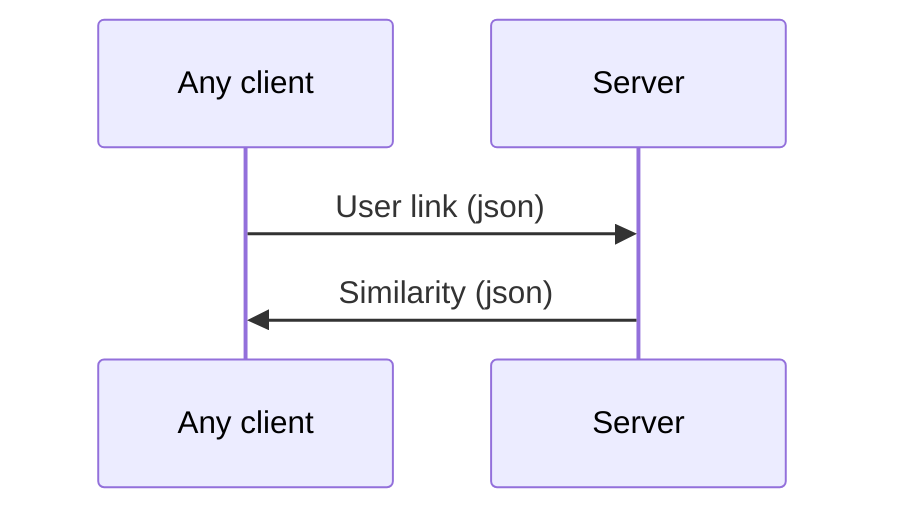

# Welcome to Fake news 

This project aims to detect **Fake news**
This repository hosts only the server side of the project


# Installation

> pip install -r requirements.txt

## Dependencies

[](https://github.com/requests)[requests /  requests](https://github.com/requests/requests)

Known security vulnerability in `2.18.4`

[](https://github.com/tartley)[tartley /  colorama](https://github.com/tartley/colorama)

`0.3.9`

[](https://github.com/goose3)[goose3 /  goose3](https://github.com/goose3/goose3)

`3.1.6`

[](https://github.com/michaelhelmick)[michaelhelmick /  lassie](https://github.com/michaelhelmick/lassie)

`0.11.7`

[](https://github.com/fhamborg)[fhamborg /  news-please](https://github.com/fhamborg/news-please)

`1.2.50`

[](https://github.com/SlapBot)[SlapBot /  newsapi](https://github.com/SlapBot/newsapi)

`0.1.1`

[](https://github.com/mattlisiv)[mattlisiv /  newsapi-python](https://github.com/mattlisiv/newsapi-python)

`0.2.3`

[](https://github.com/nltk)[nltk /  nltk](https://github.com/nltk/nltk)

`3.3`

[](https://github.com/numpy)[numpy /  numpy](https://github.com/numpy/numpy)

`1.15.1`

[](https://github.com/wtolson)[wtolson /  spacy](https://github.com/wtolson/spacy)

## use pipreqs to update requirements.txt
run
> pipreqs ./  or pipreqs  ./ --force


## Api 

```python
from fake_news.crawler.query_data import Data

print("enter URL")
url =  input()

# initialize the data object by passing in an URL in the constructor
data = Data(url)

# Data.get_all_data()  returns a dictionary
# dictionary keys "all" , "sources" , "titles" ,  "descriptons",  "contents"
all_data = data.get_all_data()

# prints all the main text of the articles in the list
print(all_data["contents"])

```

## Explanation

The Data class has a method get_all_data()
which returns a python dictionary with keys "all" , "sources" , "titles" ,  "descriptons",  "contents"
every key returns a list 
the size of the list is maximum 6 
the first element is the data from the user and others are carwled from the internet

## Sample usage with NLP

```python
from fake_news.nlp.cosine_bow import cosine_similartity_bow

from fake_news.crawler.query_data import Data

print("enter URL")

url =  input()
data = Data(url)
all_data = data.get_all_data()

# returns the cosine similarity with bow vectors of the first element compared to all
print(cosine_similartity_bow(all_data["contents"]))
```


## Known Issues 

- measures need to be taken if the keywords returned are null

## Server Architecture


