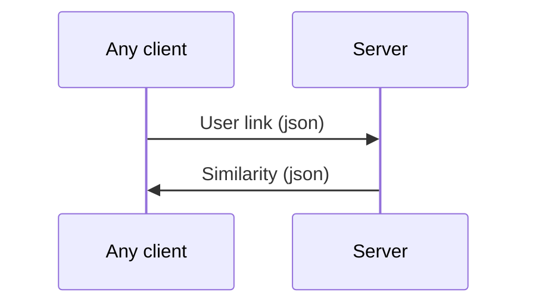

  

# Welcome to Fake news

  

  

This project aims to detect **Fake news**

  

This repository hosts only the server side of the project

  

  

# Installation

  

  

> pip install -r requirements.txt


## use pipreqs to update requirements.txt

  

run

  

> pipreqs ./ or pipreqs ./ --force

  

  

## Api

  

  

```python
from abstractor import with_keywords,without_keywords

url = input()
without_keywords(url)

url = input()
keywords = input()
with_keywords(url,keywords)
``` 

  

## Explanation

  The without_keywords method is to be used initially 
  if it fails then  we manually ask the user for the keywords
  

  

## Server Architecture

  

  

